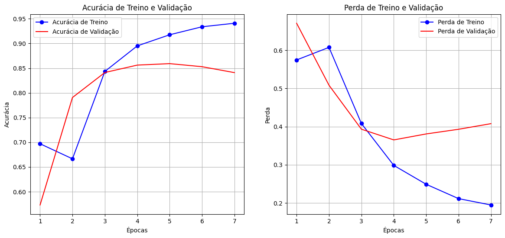

# Classificador de Sentimentos de Críticas de Filmes com RNN/LSTM e TensorFlow


## 📖 Visão Geral do Projeto

Este projeto demonstra a construção, treinamento e avaliação de um modelo de **Rede Neural Recorrente (RNN)** com uma camada **LSTM Bidirecional** para a tarefa de **Análise de Sentimentos**. O objetivo é classificar críticas de filmes (em inglês) do dataset IMDb como "Positivas" ou "Negativas".

O notebook implementa um pipeline completo de Processamento de Linguagem Natural (PLN), desde o carregamento eficiente dos dados até a capacidade de realizar predições em texto puro, tornando-o um excelente exemplo de uma solução de PLN de ponta a ponta.

## ✨ Principais Características

- **Carregamento Eficiente de Dados**: Utiliza a API `tf.keras.utils.text_dataset_from_directory` para carregar e rotular dados de texto diretamente da estrutura de pastas, otimizando a performance com `.cache()` e `.prefetch()`.
- **Pré-processamento Integrado**: A camada `TextVectorization` do Keras é usada para padronizar, tokenizar e vetorizar o texto. Por estar integrada ao modelo, garante que o mesmo pré-processamento seja aplicado de forma consistente no treino, validação e inferência.
- **Arquitetura RNN Moderna**: Emprega uma camada **LSTM Bidirecional**, que permite ao modelo capturar o contexto do texto lendo a sequência tanto da esquerda para a direita quanto da direita para a esquerda.
- **Prevenção de Overfitting**: Implementa **Dropout** e **Early Stopping** (`EarlyStopping`), uma técnica crucial que monitora a perda na validação e interrompe o treinamento quando o modelo para de melhorar, restaurando os melhores pesos encontrados.
- **Visualização Clara dos Resultados**: Gera gráficos de acurácia e perda durante o treinamento para uma análise visual do comportamento e da generalização do modelo.

## 📊 Dataset

O projeto utiliza o **Large Movie Review Dataset (ACL IMDb v1)**. Este é um dataset clássico para classificação binária de sentimentos.

- **Conteúdo**: 50.000 críticas de filmes.
- **Estrutura**:
  - `25.000` críticas para treino.
  - `25.000` críticas para teste.
- **Rótulos**: As críticas já estão divididas em pastas `pos` (positivo) e `neg` (negativo).
- **Download**: [Disponível em Stanford AI Group](https://ai.stanford.edu/~amaas/data/sentiment/)

## 🏗️ Arquitetura do Modelo

O modelo foi construído de forma sequencial utilizando a API Keras do TensorFlow:

1.  **Camada de Entrada (`Input`)**: Recebe strings de texto puro com `shape=(1,)`.
2.  **Camada de Pré-processamento (`TextVectorization`)**: Transforma o texto em sequências de inteiros.
    - `max_tokens` (tamanho do vocabulário): 10.000
    - `output_sequence_length` (comprimento da sequência): 250
3.  **Camada de Embedding (`Embedding`)**: Converte os inteiros em vetores densos, aprendendo a representação semântica das palavras.
    - `input_dim`: 10.000
    - `output_dim`: 16
4.  **Camada RNN (`Bidirectional(LSTM)`)**: Processa as sequências de vetores para extrair features contextuais.
    - Unidades LSTM: 32
5.  **Camadas de Classificação (`Dense` + `Dropout`)**:
    - Uma camada `Dense` com 32 neurônios e ativação `relu`.
    - Uma camada de `Dropout` com taxa de `0.7` para regularização.
    - A camada de saída `Dense` com 1 neurônio e ativação `sigmoid` para a classificação binária.

```
Model: "sequential_1"
_________________________________________________________________
 Layer (type)                Output Shape              Param #
=================================================================
 text_vectorization_2 (TextV  (None, 250)               0
 ectorization)

 embedding_layer (Embedding) (None, 250, 16)           160000

 bidirectional_2 (Bidirection  (None, 64)                12544
 al)

 dense_2 (Dense)             (None, 32)                2080

 dropout_1 (Dropout)         (None, 32)                0

 dense_3 (Dense)             (None, 1)                 33

=================================================================
Total params: 174657 (682.25 KB)
Trainable params: 174657 (682.25 KB)
Non-trainable params: 0 (0.00 B)
_________________________________________________________________
```

## ⚙️ Instalação e Execução

Para executar este projeto localmente, siga os passos abaixo:

1.  **Clone o repositório:**
    ```bash
    git clone https://github.com/seu-usuario/seu-repositorio.git
    cd seu-repositorio
    ```

2.  **Crie e ative um ambiente virtual (recomendado):**
    ```bash
    python -m venv .venv
    # Windows
    .venv\Scripts\activate
    # macOS/Linux
    source .venv/bin/activate
    ```

3.  **Instale as dependências:**
    ```bash
    pip install tensorflow matplotlib
    ```

4.  **Baixe e prepare o dataset:**
    - Baixe o arquivo `aclImdb_v1.tar.gz` do [link oficial](https://ai.stanford.edu/~amaas/data/sentiment/).
    - Crie uma pasta `data` na raiz do projeto.
    - Descompacte o conteúdo do arquivo dentro da pasta `data`, de forma que a estrutura final seja `data/aclImdb/`.

5.  **Execute o Jupyter Notebook:**
    ```bash
    jupyter notebook notebook.ipynb
    ```

## 📈 Resultados e Avaliação

O modelo foi treinado por 7 épocas, interrompido pelo callback `EarlyStopping` que restaurou os pesos da 4ª época, onde a perda na validação foi mínima.

A acurácia final alcançada no conjunto de teste (dados nunca vistos) foi de **84.07%**.

### Curvas de Aprendizagem

O gráfico abaixo mostra a evolução da acurácia e da perda nos conjuntos de treino e validação. A proximidade entre as curvas de treino e validação indica que o modelo generalizou bem, evitando overfitting significativo.



### Teste com Novas Frases

O modelo final é capaz de classificar novas críticas com alta confiança:

| Crítica                                                                                       | Predição  | Confiança |
| --------------------------------------------------------------------------------------------- | --------- | :-------: |
| "This movie was absolutely fantastic, I really loved it and would recommend it to everyone!"  | Positivo  |  92.27%   |
| "It was a complete waste of my time. The plot was predictable and the acting was subpar."      | Negativo  |  98.73%   |
| "The movie was okay, not great but not terrible either. A bit forgettable."                   | Negativo  |  93.93%   |
| "The special effects were good, but the story was incredibly boring."                         | Negativo  |  94.37%   |

## 🚀 Possíveis Melhorias

- **Embeddings Pré-treinadas**: Utilizar embeddings como GloVe ou Word2Vec para inicializar a camada de `Embedding`, o que pode melhorar a performance, especialmente com datasets menores.
- **Arquiteturas Alternativas**: Experimentar com camadas **GRU (Gated Recurrent Unit)** ou arquiteturas mais complexas como **Transformers (ex: BERT)** para capturar relações contextuais mais sofisticadas.
- **Ajuste de Hiperparâmetros**: Realizar uma busca otimizada (usando KerasTuner ou Optuna) para encontrar a melhor combinação de hiperparâmetros (ex: dimensão do embedding, unidades LSTM, taxa de dropout).
- **Deploy**: Empacotar o modelo treinado e implantá-lo como uma API REST usando Flask ou FastAPI para uso em aplicações reais.